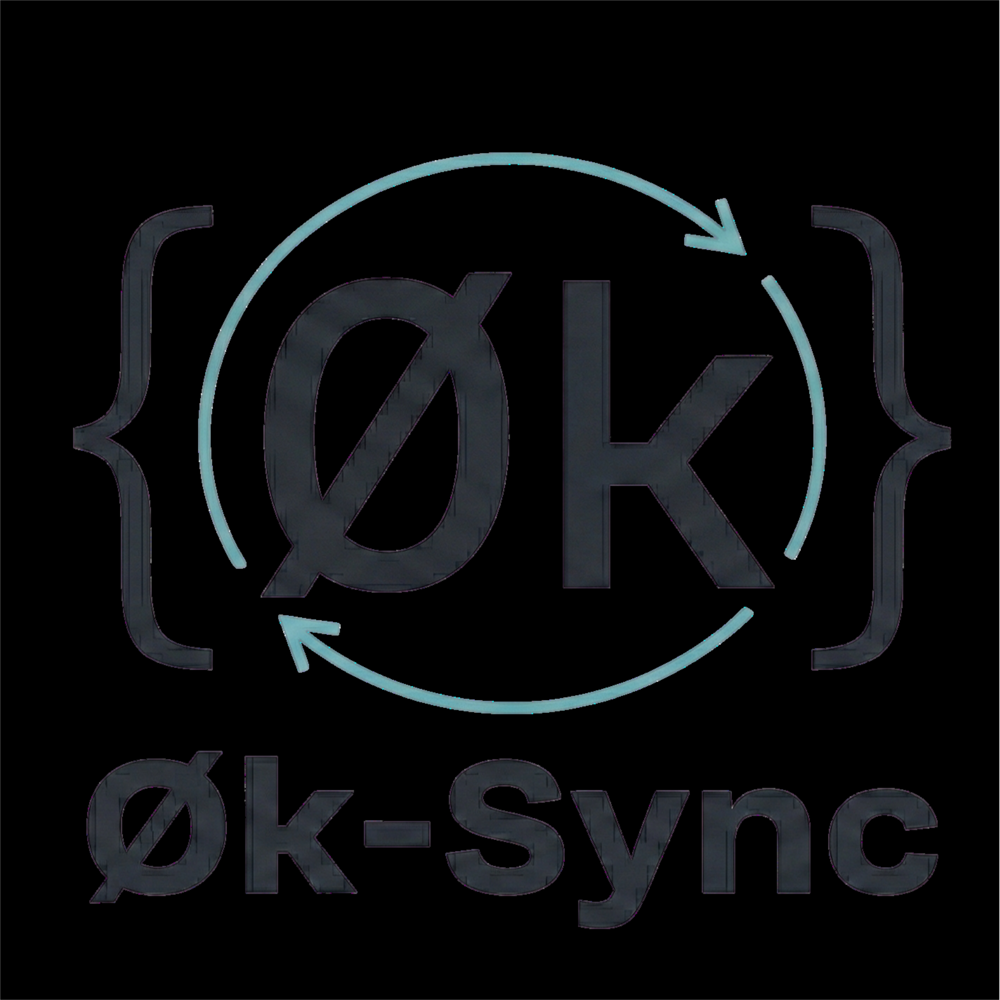

<p align="center">
  
</p>

<p align="center">
  <strong>Zero-knowledge sync for local-first apps.</strong>
</p>

<p align="center">
  <em>The relay never sees your data. Not encrypted-at-rest-but-we-have-the-keys.<br>Actually zero knowledge. The relay is a dumb pipe that routes ciphertext between your devices.</em>
</p>

```
┌─────────────────────────────────────────────────────────────────────────────┐
│                                                                             │
│   Device A                        RELAY                        Device B    │
│   ┌───────┐                    ┌─────────┐                    ┌───────┐    │
│   │ App   │                    │ Routes  │                    │ App   │    │
│   │ Data  │──► Encrypt ──────► │ Opaque  │ ──────────────────►│ Data  │    │
│   │       │   (your key)       │ Blobs   │      Decrypt ◄─────│       │    │
│   └───────┘                    │         │     (your key)     └───────┘    │
│                                │ Sees:   │                                 │
│                                │ Nothing │                                 │
│                                └─────────┘                                 │
│                                                                             │
└─────────────────────────────────────────────────────────────────────────────┘
```

---

## Why?

Most "encrypted sync" services hold your keys. They pinky-promise not to look. 0k-Sync takes a different approach: **the relay can't look, even if compromised.**

- **No accounts.** Devices pair via passphrase or QR code.
- **No key escrow.** Keys derive from your passphrase via Argon2id. We never see them.
- **Minimal metadata.** The relay sees blob sizes and timing, but never content, file names, or structure.
- **No trust required.** Run your own relay. Or use ours. The cryptography is the same.
- **Runs anywhere.** Pure Rust, no runtime. Designed for edge hardware, slow networks, and battery-constrained devices.

---

## The Vision

We're building for a world where edge AI runs on edge chips — and those devices need a reliable, secure sync protocol to deliver context updates in seconds, not minutes.

**Edge AI scenarios:**
- Autonomous agents on long missions, maintaining shared context even when far from base
- Drone swarms that need to sync state without a central server seeing the mission
- Field sensors pushing readings back to your infrastructure, not someone else's cloud

**Personal privacy scenarios:**
- Sync your health data across devices without Google knowing your weight or running route
- Family photo sharing that doesn't train someone else's AI model
- Personal journals, financial tracking, medical records — yours, not theirs

**Not just messages — large files too.** Photos, video, sensor dumps, AI model checkpoints. Content is encrypted locally, chunked, and transferred with content-addressed hashing (BLAKE3). The relay never sees what's inside.

The relay doesn't care what you're syncing. It just moves ciphertext. That's the point.

---

## Built With Rust

No garbage collector. No runtime. No Electron. Just compiled machine code.

- **Lightweight footprint** — small relay binary, minimal client library overhead
- **Memory-adaptive** — Argon2id scales to available RAM (19-64 MiB)
- **Instant startup** — no VM warmup, no JIT compilation
- **Edge-ready** — designed for resource-constrained, bandwidth-limited environments

---

## Transport Layer

Built on [iroh](https://github.com/n0-computer/iroh) — a Rust networking stack with QUIC transport. MIT licensed, running on hundreds of thousands of devices.

**Our priority: Resilient relay infrastructure, not P2P.**

iroh supports P2P hole-punching, and we get that for free. But our focus is **multi-relay failover** — the ability to run multiple relays and fail over seamlessly when one goes down. Single relay = single point of failure. That's not acceptable for production workloads.

**Why relay-first:**
- QUIC-based (UDP, not TCP) — works through NATs, handles packet loss gracefully
- [iroh's own docs](https://docs.iroh.computer/concepts/relays) say: *"For production, use dedicated relays"* — we agree
- **Multi-relay fan-out is implemented** — connect failover, push to multiple relays, per-relay cursor tracking
- P2P is a nice-to-have optimization, not the core architecture

**What if iroh disappears?**

The sync protocol is transport-agnostic. `sync-types` and `sync-core` have zero iroh dependencies — pure Rust, no networking code. The transport layer (`IrohTransport`) is a ~500 line adapter. If iroh vanished tomorrow:
- Fork it (MIT license)
- Or swap in another QUIC stack (quinn, etc.)
- The encryption and sync logic don't change

**Post-quantum:** iroh uses TLS 1.3. They've [stated](https://github.com/n0-computer/iroh/discussions) they're not prioritizing hybrid PQ crypto. We are — that's why our [Appendix B](appendix-b-hybrid-crypto.md) design uses clatter (Noise + ML-KEM-768) at the *application layer*, independent of transport.

---

## Who's This For?

**For defense & industrial:**
You need context sync for autonomous systems operating in contested environments. Drones, sensors, field units — they need to share state reliably, even when comms are degraded. You need multi-relay failover so one downed node doesn't break the mission. You need zero-knowledge so captured hardware reveals nothing about the network. This is that.

**For privacy-conscious individuals:**
You want to sync your health data, personal journals, family photos — without feeding Google's ad machine or training someone else's AI. No accounts. No cloud provider reading your files "to improve services." Just your devices, your keys, your data.

**For the nerds:**
You care about the crypto. Good. So do we.

| Layer | Algorithm | Why |
|-------|-----------|-----|
| Blob encryption | XChaCha20-Poly1305 | 256-bit key, 192-bit nonce — no nonce reuse risk even at scale |
| Key derivation | Argon2id | 19-64 MiB memory-hard — OWASP minimum enforced, adapts to device |
| Transport | QUIC (TLS 1.3) | UDP-based, handles packet loss, NAT traversal |
| Content addressing | BLAKE3 | Encrypt-then-hash — fast, parallelizable, collision-resistant |

**Post-quantum?** Hybrid Noise Protocol (ML-KEM-768 + X25519) is [designed](appendix-b-hybrid-crypto.md) but not yet implemented. We're building it at the application layer so we don't depend on transport upgrades.

**Security audits:** Two internal audits completed (2026-02-05). 35 findings, 0 critical/high remaining. Reports in `docs/reviews/`.

---

## Quick Start

### Self-Hosted Relay (Docker)

```bash
# Build from source (not yet published to container registry)
git clone https://github.com/ydun-code-library/0k-sync.git
cd 0k-sync
docker build -t 0k-sync-relay .
docker run -d -p 8080:8080 -v relay-data:/data --name 0k-relay 0k-sync-relay

# Health check
curl http://localhost:8080/health
```

### CLI (for testing)

```bash
# Build from source (not yet published to crates.io)
git clone https://github.com/ydun-code-library/0k-sync.git
cd 0k-sync
cargo build --release -p zerok-sync-cli

# Initialize device
./target/release/sync-cli init --name "my-laptop"

# Create a sync group (generates passphrase)
./target/release/sync-cli pair --create

# On second device: join with the passphrase
./target/release/sync-cli pair --join --passphrase "correct-horse-battery-staple"

# Sync
./target/release/sync-cli push "Hello from laptop"
./target/release/sync-cli pull
```

### Library (for your app)

```toml
# Cargo.toml (not yet on crates.io — use git dependency)
[dependencies]
sync-client = { git = "https://github.com/ydun-code-library/0k-sync.git" }
```

```rust
use sync_client::{SyncClient, SyncConfig, GroupSecret};

// Derive group key from passphrase
let secret = GroupSecret::from_passphrase("correct-horse-battery-staple");
let config = SyncConfig::new(secret, relay_node_id);

// Connect and sync
let client = SyncClient::connect(config).await?;
client.push(b"encrypted by the time it leaves your device").await?;
let blobs = client.pull().await?;
```

---

## Architecture

```
┌────────────────────────────────────────────────────────────────┐
│                        Your Application                         │
├────────────────────────────────────────────────────────────────┤
│  sync-client         │ E2E encryption, transport, cursors      │
├──────────────────────┼─────────────────────────────────────────┤
│  sync-core           │ State machine, buffer logic (no I/O)    │
├──────────────────────┼─────────────────────────────────────────┤
│  sync-types          │ Wire format (MessagePack)               │
├────────────────────────────────────────────────────────────────┤
│  iroh QUIC           │ Relay-first transport (P2P optional)    │
└────────────────────────────────────────────────────────────────┘

                              ▼

┌────────────────────────────────────────────────────────────────┐
│                         sync-relay                              │
├────────────────────────────────────────────────────────────────┤
│  • Routes opaque blobs between paired devices                  │
│  • SQLite storage (WAL mode) for offline buffering             │
│  • Rate limiting (per-device + global)                         │
│  • Zero plaintext, zero metadata logging                       │
└────────────────────────────────────────────────────────────────┘
```

**Crate breakdown:**

| Crate | Purpose | Tests |
|-------|---------|-------|
| `sync-types` | Wire format, message definitions | 33 |
| `sync-core` | Pure logic, no I/O (instant tests) | 70 |
| `sync-client` | Client library for applications | 63 |
| `sync-content` | Large file transfer (encrypt-then-hash) | 24 |
| `sync-cli` | CLI tool for testing/debugging | 30 |
| `sync-relay` | Relay server | 51 |

**321 tests passing.** Chaos test harness in progress (50 passing, 28 stubs awaiting infrastructure).

---

## Deployment Options

| Tier | Setup | Cost | Who's it for |
|------|-------|------|--------------|
| **Hobbyist** | Use iroh public network | Free | Tinkering, dev |
| **Self-Hosted** | Docker on your server | Your electricity | Privacy maximalists |
| **PaaS** | Railway, Fly.io, etc. | ~$5-50/mo | Small teams |

The client library is identical across all tiers. Only the relay endpoint changes.

---

## What This Is (and Isn't)

**Is:**
- A sync primitive for local-first apps
- A secure relay for routing encrypted blobs
- Framework-agnostic (Tauri, Electron, mobile, CLI)

**Isn't:**
- A database (you handle storage)
- A CRDT library (you handle conflict resolution)
- A backup service (the relay is ephemeral)
- A replacement for Syncthing (different use case — this is for app developers)

---

## Threat Model

**What the relay knows:**
- That Device A and Device B are paired (they share a group ID derived from the passphrase)
- That *something* was synced (blob size, timestamp)
- Connection metadata (IP addresses, unless using Tor/VPN)

**What the relay cannot know:**
- The passphrase
- The plaintext content
- File names, types, or structure
- How many items are in a blob (it's all one ciphertext)

**What would break this:**
- Compromise of your passphrase
- Compromise of a paired device
- A flaw in XChaCha20-Poly1305 or Argon2id (unlikely)
- A future quantum computer (mitigated by planned hybrid PQ)

---

## Documentation

| Doc | What's in it |
|-----|--------------|
| [Executive Summary](docs/01-EXECUTIVE-SUMMARY.md) | Architecture overview |
| [Specification](docs/02-SPECIFICATION.md) | Protocol details, message formats |
| [Implementation Plan](docs/03-IMPLEMENTATION-PLAN.md) | TDD phases, what's built |
| [Chaos Testing](docs/06-CHAOS-TESTING-STRATEGY.md) | Failure scenarios, invariants |
| [Hybrid Crypto Design](appendix-b-hybrid-crypto.md) | Post-quantum roadmap |
| [E2E Testing Guide](docs/E2E-TESTING-GUIDE.md) | How to run integration tests |

---

## Status

**Where we're at:** Phase 6.5 complete. The core protocol works end-to-end with multi-relay redundancy.

| What | Status |
|------|--------|
| Wire format (sync-types) | ✅ Done — 33 tests |
| Core logic (sync-core) | ✅ Done — 70 tests |
| Client library (sync-client) | ✅ Done — 63 tests |
| Large file transfer (sync-content) | ✅ Done — 24 tests |
| CLI tool (sync-cli) | ✅ Done — 30 tests |
| Relay server (sync-relay) | ✅ Done — 51 tests |
| Multi-relay fan-out | ✅ Done — connect failover, push fan-out, per-relay cursors |
| E2E cross-machine testing | ✅ Verified Q ↔ Beast |
| Security audit | ✅ 2 audits, 0 critical/high remaining |
| Docker deployment | ✅ Working |
| Chaos test harness | 🔜 Infrastructure needed |
| Crates.io publish | 🔜 After chaos hardening |
| Hybrid post-quantum (Noise + ML-KEM) | 📋 Designed, not implemented |

**321 tests passing.** This isn't vaporware — it's working code.

**What's next:**
- Chaos test harness (network fault injection for QUIC)
- Crates.io publish
- Hybrid post-quantum handshake

---

## Contributing

PRs welcome. The codebase follows TDD — if it's not tested, it doesn't exist.

```bash
cargo build --workspace
cargo test --workspace
cargo clippy --workspace
```

See [AGENTS.md](AGENTS.md) for development guidelines.

---

## License

MIT OR Apache-2.0 (your choice).

---

<p align="center">
  <br>
  <em>Because "trust us" isn't a security model.</em>
</p>
