# Appendix D: Tactical Mesh Profile — relay-sync as Swarm Context Distribution Network

**relay-sync Protocol Specification — Appendix D**
**Version:** 2.1.0 (Reviewer Feedback Integrated)
**Status:** EXPLORATORY — Strategic Portfolio Document
**Classification:** Forward-Looking Architecture Study
**Date:** 2026-02-01
**Cross-References:**
- Technical Specification v2.1.0 + v2.2.0 Amendments
- Implementation Plan v2.0.0
- Appendix B: Hybrid Cryptographic Compliance
- iroh Deep Dive Report (Section 11: Dependency Risk & Sovereignty)
- Licensing Strategy Amendment v1.1

---

## Table of Contents

1. [Thesis — A Context Network, Not a Control Bus](#1-thesis)
2. [Strategic Context — Why This Matters Now](#2-strategic-context)
   - 2.1 The Replicator Problem: Interoperability Without Standards
   - 2.2 Sweden's Drone Swarm Initiative
   - 2.3 The Signal Protocol Precedent
   - 2.4 The Harvest Now, Decrypt Later Threat
3. [Architecture — Swarm Role Definitions](#3-architecture)
   - 3.1 Intel (ISR)
   - 3.2 Defense (EW / Counter-UAS / Escort)
   - 3.3 Offense (Strike / Loiter / Payload)
   - 3.4 Relay (Mesh Backbone)
   - 3.5 Mesh Topology
   - 3.6 Base Station
4. [Security Architecture — Compartmentalized Sync Groups](#4-security)
   - 4.1 Sync Group Matrix
   - 4.2 Capture Scenario Analysis
   - 4.3 The Zero-Knowledge Relay Advantage
5. [Communication Modes](#5-communication-modes)
   - 5.1 Sync Mode (Existing)
   - 5.2 Stream Mode (Extension)
   - 5.3 Command Mode (Extension)
   - 5.4 Beacon Mode (Extension)
   - 5.5 Mode Summary
6. [Relay Drone Architecture](#6-relay-drone)
   - 6.1 Software Stack
   - 6.2 Relay Redundancy and Election
   - 6.3 Base Backhaul and Bandwidth Allocation
7. [Lightweight Wire Format](#7-wire-format)
8. [Commissioning and Device Lifecycle](#8-commissioning)
   - 8.1 Pre-Mission Commissioning
   - 8.2 Mid-Mission Rekeying
   - 8.3 Post-Mission Decommissioning
9. [What Exists vs. What Needs Building](#9-readiness)
10. [Critical Analysis — Honest Assessment](#10-critical-analysis)
    - 10.1 What Is Genuinely Strong
    - 10.2 Where the Gaps Are Real
    - 10.3 What This Document Actually Is
11. [Industrial and Civilian Applications](#11-civilian)
12. [Export Control Considerations](#12-export-control)
13. [Strategic Value](#13-strategic-value)
14. [Competitive Landscape](#14-competitive-landscape)
15. [Visual Topology — Same Protocol, Different Altitude](#15-visual-topology)
16. [Open Questions for Future Research](#16-open-questions)
17. [Sources and References](#17-sources)

---

## 1. Thesis — A Context Network, Not a Control Bus

This document explores how a privacy-preserving device synchronization protocol — designed to sync encrypted journals across phones and laptops — maps architecturally to coordinating autonomous drone swarms.

**The central insight is not about real-time control.**

Modern autonomous drones do not wait for network commands to make millisecond decisions. Collision avoidance, threat evasion, formation keeping, and sensor processing happen onboard, on silicon, at inference speeds that no network can match. Edge AI running on hardware like NVIDIA Jetson Orin Nano (40 TOPS at 15W) handles real-time object detection, obstacle avoidance, and autonomous navigation without any network dependency. [→ Source: Micron, "Edge AI in the Sky," 2025; arxiv.org/html/2507.15049v1]

The network's job is different. The network keeps those onboard AI systems *contextually current*:

- Updated threat libraries ("new radar signature detected by another drone")
- Revised target packages ("target coordinates updated, previous package superseded")
- Sensor fusion products ("I2 just imaged grid square Delta-7, here's the processed output")
- Rules of engagement changes ("weapons hold in sector Bravo, effective immediately")
- Mission boundary revisions ("search area expanded north by 2km")

This information is measured in seconds of acceptable latency, not milliseconds. A threat library update that arrives 3 seconds later is still perfectly useful — the onboard AI was already using the previous version to make autonomous decisions. A target package that syncs in 5 seconds is fine — the strike drone wasn't going to fire until it received the package anyway.

**This is literally the same pattern as Private Suite's Personal AI architecture.** The drone's onboard AI is the Personal AI. The relay-sync network is the context pipeline feeding it indexed, encrypted, locally-stored knowledge. "Phone was offline, comes back and syncs its journal" becomes "Drone was out of range, flies back and its onboard AI catches up on everything it missed."

We are not designing a drone protocol. We are documenting how an existing privacy protocol, when deployed on airborne nodes with onboard intelligence, naturally provides the context distribution that purpose-built military C2 systems struggle with — because those C2 systems were designed for an era when drones were dumb actuators that needed real-time remote control. That era is ending.

---

## 2. Strategic Context — Why This Matters Now

### 2.1 The Replicator Problem: Interoperability Without Standards

The U.S. Pentagon's Replicator program, launched August 2023 with $1 billion in funding, aimed to field thousands of autonomous drone systems by August 2025. It has largely struggled. The program fielded hundreds of drones rather than the thousands targeted, was plagued by technical failures across multi-vendor systems, and was reorganized under SOCOM's new Defense Autonomous Warfare Group (DAWG) in late 2025. [→ Source: Washington Times, Nov 2025; DefenseScoop, Sep 2025; Congress.gov CRS Report IF12611]

The core problem is instructive: **networking diverse drone systems from multiple manufacturers into coordinated autonomous fleets.** The Pentagon has yet to identify reliable AI battle command software capable of managing multi-vendor systems effectively. The program selected seven different software vendors just for autonomy and command-and-control integration — and they still can't reliably talk to each other. [→ Source: DroneXL, Sep 2025; Wall Street Journal, Sep 2025]

This is the interoperability gap that an open protocol addresses. relay-sync doesn't care what hardware it runs on. It doesn't care what flight controller is underneath. It provides an encrypted, reliable, auditable context distribution layer that any system can integrate — the same way the Signal Protocol doesn't care whether it's running on an iPhone or an Android device.

Current drone communication relies on MAVLink for telemetry and various proprietary protocols for different functions (S.Bus for control surfaces, Lightbridge for video), with no unified encrypted sync layer. [→ Source: FlyEye, "Drone Communication Systems," 2024] Multi-UAV systems must guarantee interoperability when the swarm consists of various drone types independent of their communication protocols. [→ Source: MDPI Drones 8(10):575, Oct 2024] The lack of global communication standards for data transfer and frequency use remains the key limiter for cross-platform integration. [→ Source: MarketsAndMarkets, "Drone Communication Market," 2025]

relay-sync could fill this gap — not as a flight control protocol, but as the encrypted context layer that sits above whatever radio and telemetry stack each drone uses.

### 2.2 Sweden's Drone Swarm Initiative

In January 2025, Sweden's Defence Minister Pål Jonson announced a drone swarm project developed secretly over the preceding year with Saab — a development that would normally take 4-5 years. The system coordinates swarms of varying-size drones to perform tasks autonomously including reconnaissance, positioning, and target identification. It was tested during NATO's Arctic Strike 25 exercise in March 2025 and is being integrated into Sweden's armed forces. [→ Source: Kyiv Post, Jan 2025; Sweden Herald, Jan 2025; Army Recognition, Jan 2025]

Key details from Saab's head of strategy, Robert Lindegren: the focus is on software not hardware, with an open architecture allowing different AI classifiers to be dropped into the system. They have demonstrated hot-swapping AI classifiers in flight and reloading retrained models on the ground. In the EE Times Europe interview, Lindegren emphasized (paraphrased) that Saab designs for coalition interoperability — all systems and subsystems need to integrate with NATO partner systems rather than being locked into proprietary architectures. [→ Source: EE Times Europe, Mar 2025; paraphrased from interview, not direct quote]

This aligns precisely with relay-sync's architecture. Saab builds the drone intelligence and flight control. relay-sync provides the encrypted context distribution underneath — hardware-agnostic, open-source, auditable, interoperable with coalition systems. Sweden is NATO's newest member (joined March 2024), is investing 2.6% GDP in defense by 2028, and is actively seeking technologies that demonstrate NATO contribution capacity.

As Sweden's Prime Minister Ulf Kristersson stated: "Sweden is not at war, but it is no longer at peace." [→ Source: NordiskPost, Nov 2025]

### 2.3 The Signal Protocol Precedent

The most relevant precedent for what we're proposing is Signal Protocol's trajectory.

Signal Protocol was designed in 2013 by Open Whisper Systems for a consumer messaging app. Its properties — end-to-end encryption, forward secrecy, open source, peer-reviewed — made it the gold standard for private communication. WhatsApp adopted it in 2016 to encrypt conversations for over a billion users. Google Messages, Facebook Messenger, and Skype followed. The protocol now protects billions of conversations daily. [→ Source: Signal.org; Wikipedia, "Signal Protocol"]

Critically, the same protocol designed for consumer chat became the *de facto* standard for sensitive government communication — not because it was designed for government use, but because its security properties were genuinely superior to purpose-built alternatives. The Signalgate incident in early 2025, where U.S. national security officials discussed Yemen military strikes on Signal, demonstrated both the protocol's adoption at the highest levels and the trust placed in its cryptographic guarantees. [→ Source: Bulletin of the Atomic Scientists, Apr 2025]

As one security researcher characterized it: Signal is designed to be a "dumb pipe for encrypted data, nothing more" — which is exactly what makes it trustworthy. [→ Source: activeness.social, Sep 2025]

relay-sync follows the same trajectory. Consumer privacy protocol → enterprise adoption → defense evaluation → standard. The difference: relay-sync is built with post-quantum cryptography from day one, which Signal is only now retrofitting via PQXDH. [→ Cross-ref: Appendix B, Hybrid Cryptographic Compliance]

### 2.4 The Harvest Now, Decrypt Later Threat

Military drone communications have multi-year, often multi-decade classification periods. Intelligence gathered during an operation may remain classified for 25-75 years. An adversary who intercepts encrypted tactical communications today and stores them is making a rational investment — quantum computers capable of breaking current public-key encryption may arrive within 10-20 years.

This "Harvest Now, Decrypt Later" (HNDL) strategy is not theoretical. Major cybersecurity agencies — the U.S. Department of Homeland Security, the UK's National Cyber Security Centre, the EU Agency for Cybersecurity (ENISA), and the Australian Cyber Security Centre — all base their post-quantum guidance on the premise that adversaries are currently collecting and storing encrypted data for future decryption. [→ Source: Freshfields, "Quantum Disentangled #1," Dec 2025; Palo Alto Networks, "HNDL," 2025]

NIST finalized its first post-quantum cryptography standards in August 2024 (FIPS 203, 204, and 205), providing concrete alternatives to vulnerable algorithms. relay-sync's Appendix B specifies ML-KEM-768 (FIPS 203) in a hybrid scheme with Curve25519 — belt and suspenders. If ML-KEM is somehow broken, classical Curve25519 still protects. If Curve25519 falls to quantum attack, ML-KEM still protects. Both must be broken simultaneously. [→ Cross-ref: Appendix B, Section 3: Hybrid Key Exchange]

For tactical communications, this means: a captured relay drone's encrypted buffer is protected not just against today's adversaries, but against adversaries with future quantum computers. That's not a feature — it's a requirement that most current military communication systems do not yet meet.

---

## 3. Architecture — Swarm Role Definitions

A relay-sync tactical mesh maps drone roles to protocol participants. Each role has distinct communication profiles, capture risk levels, and sync group memberships.

### 3.1 Intel (ISR)

**Mission:** Imagery, SIGINT, mapping, sensor fusion. The eyes of the swarm.

**Capture risk: HIGH.** Operates closest to adversary. Most likely to be detected, jammed, or physically captured. However, Intel drones carry only Intel-group context — they have zero knowledge of offense plans or defense parameters. [→ See Section 4.2: Capture Scenario Analysis]

**Context distribution profile:**
- HIGH bandwidth upstream: 2-10MB processed imagery products, sensor fusion outputs
- LOW bandwidth downstream: updated collection requirements, search grid assignments, threat library updates
- The onboard AI handles: image processing, object detection/classification, terrain mapping, autonomous flight path optimization
- The network provides: "here's what base wants you to look for next," "here's what I3 found in the adjacent grid," "threat library v7 — new radar signature added"

**Protocol mapping:**
- sync-content (iroh-blobs) for imagery upload to base via relay
- relay-sync cursor-ordered entries for collection requirements and mission updates
- iroh-gossip for threat detections that other drones' onboard AI should absorb

### 3.2 Defense (EW / Counter-UAS / Escort)

**Mission:** Protect the swarm. Jamming, electronic warfare, interception, decoy, escort high-value nodes.

**Capture risk: MEDIUM.** Reveals defensive capabilities and EW parameters, but not offensive intent or intelligence requirements.

**Context distribution profile:**
- CRITICAL latency lateral: threat broadcasts that update other drones' onboard threat models
- MEDIUM bandwidth to base: threat assessment reports, EW effectiveness data
- The onboard AI handles: threat classification, jamming execution, evasive maneuvers, counter-UAS engagement
- The network provides: updated threat libraries, EW parameter sets, sector defense assignments, ROE updates

**Protocol mapping:**
- iroh-gossip for threat alert broadcasts (defense → all, updating onboard AI threat models)
- relay-sync for EW parameter distribution and defense-only operational data
- Stream mode for defensive system telemetry to base

### 3.3 Offense (Strike / Loiter / Payload)

**Mission:** Deliver effects. The most expendable role — expected to be lost during mission execution.

**Capture risk: HIGHEST for loss, but LOWEST information exposure.** Offense drones should carry the absolute minimum context. Their onboard AI needs only: current target package, weapon delivery parameters, abort conditions, and basic navigation.

**Context distribution profile:**
- LOW bandwidth upstream: status reports, weapon system readiness
- CRITICAL downstream: target packages (sync mode — must be complete and verified), go/no-go authorization, abort signals
- The onboard AI handles: terminal guidance, weapon delivery, evasion during approach, autonomous abort if conditions exceed parameters
- The network provides: "here is your target package," "go/no-go status: HOLD," "abort abort abort"

**Protocol mapping:**
- relay-sync cursor-ordered commands for target packages (must arrive complete, verified, in-order)
- Command mode (dual-path) for abort and weapons hold signals
- Minimal telemetry upstream via gossip

**Security principle:** If captured, an offense drone reveals only its current target. Not the intelligence that selected the target. Not the defense posture. Not other targets. Not base location. This falls directly from compartmentalized sync groups. [→ See Section 4.1]

### 3.4 Relay (Mesh Backbone)

**Mission:** Communication infrastructure. Flying relay servers. The relay drone is the most interesting node because it runs the exact same software as a consumer relay-sync deployment — just on a drone instead of a VPS.

**Capture risk: HIGH for traffic analysis, ZERO for content.** This is relay-sync's defining property applied to an airborne platform. The relay stores encrypted blobs it cannot decrypt. It knows traffic patterns (which EndpointIds communicate, how much data, timing) but has zero access to content. Every blob is opaque ciphertext. [→ See Section 4.3]

**Protocol mapping:**
- Runs sync-relay server (identical binary to consumer deployment)
- Runs iroh-relay for QUIC connection brokering
- Runs iroh-blobs cache for large content store-and-forward
- mDNS discovery for worker drones in radio range
- Relay-to-relay mesh via iroh direct QUIC connections

### 3.5 Mesh Topology

```
               [BASE STATION]
              (analysis, planning,
               human-in-the-loop)
                    ↕
            long-range backhaul
            (satellite / directional)
                    ↕
    ┌───────[RELAY ALPHA]───────[RELAY BRAVO]───────┐
    │        mesh link ←——→ mesh link                │
    │           ↕                    ↕                │
    │     ┌─────┴─────┐       ┌─────┴─────┐         │
    │   [I1] [I2] [D1]      [O1] [O2] [D2]         │
    │   intel intel def      off  off  def          │
    │                                                │
    │   Sector Alpha          Sector Bravo           │
    └────────────────────────────────────────────────┘
    
    mDNS radius ≈ radio range of each relay
    Workers discover nearest relay automatically
    If RELAY ALPHA goes down:
      → I1, I2, D1 discover RELAY BRAVO via mDNS
      → Seamless failover, no reconfiguration
      → Buffered messages from ALPHA are lost (acceptable)
      → Cursor-based sync catches up from BRAVO's buffer
```

The topology is self-healing. iroh endpoints automatically handle relay failover — if a relay disappears, endpoints try the next relay in their RelayMap. Every worker drone's RelayMap is configured with all known relay drones at commissioning, sorted by preference. Failover is built into the transport layer.

### 3.6 Base Station

**Mission:** Command, control, analysis. Human operators, mission planning, intelligence fusion, legal/ethical review. May be a vehicle, ship, building, or forward operating base.

**Capture risk: LOWEST.** The base is the most protected asset. Designed for rapid teardown — if position is compromised, the base relocates and the swarm reconnects through relay discovery.

**Base redundancy:** The base is the only node with all sync group keys. If the base is destroyed or goes silent, the swarm retains autonomy — drones continue operating on last-synced context — but loses coordination and update capability. Two mitigations are possible: (a) deploy a **secondary base** with a cloned key set, operating in hot-standby with its own backhaul link; or (b) pre-designate a **roaming command authority** where a heavy-lift relay drone holds encrypted copies of SWARM_CMD keys and can be promoted to issue basic commands (RTB, abort, formation hold) if the base goes silent for longer than a configurable timeout. Option (b) is architecturally simple — the relay already runs sync-relay software and adding sync-client for SWARM_CMD is a configuration change, not a protocol change. It does expand the relay's capture risk profile, so this is a mission-specific tradeoff.

**Protocol mapping:**
- Runs sync-client for all sync groups (the only node with full visibility)
- Runs analysis pipeline (potentially the same AI pipeline as Private Suite's Personal AI — same RAG architecture, different domain)
- Archives all mission data locally (local-first, no cloud dependency)
- Operator console presents sync status across all groups

---

## 4. Security Architecture — Compartmentalized Sync Groups

This is where relay-sync's group model becomes a genuine tactical advantage. The key principle: **a captured drone reveals only what it needs for its own mission, nothing about other roles or the broader operation.** Most military C2 systems achieve compartmentalization through network segmentation — separate radios, separate frequencies, physical isolation. relay-sync achieves it cryptographically on the same channel, using the same relays.

### 4.1 Sync Group Matrix

Each communication domain is a separate sync group with its own GroupSecret, encryption keys, and device membership. A drone holds keys only for groups it participates in.

```
┌────────────────────────────────────────────────────────────────┐
│                    SYNC GROUP MATRIX                           │
│                                                                │
│  Group               Members           Content                 │
│  ─────               ───────           ───────                 │
│  SWARM_CMD           ALL + BASE        Swarm-wide commands,    │
│                                        abort signals,          │
│                                        formation changes       │
│                                                                │
│  INTEL_OPS           Intel + BASE      Collection requirements,│
│                                        imagery, sensor data,   │
│                                        mapping products        │
│                                                                │
│  DEFENSE_OPS         Defense + BASE    Threat library, EW      │
│                                        parameters, sector      │
│                                        assignments, ROE        │
│                                                                │
│  STRIKE_PKG          Offense + BASE    Target packages,        │
│                                        go/no-go auth,          │
│                                        BDA requests            │
│                                                                │
│  MESH_MGMT           Relay + BASE      Relay health, routing   │
│                                        tables, backhaul status │
│                                                                │
│  TELEMETRY           ALL → BASE        Position, heading,      │
│  (gossip, not sync)                    altitude, battery       │
│                                        (ephemeral)             │
│                                                                │
│  THREAT_ALERT        Defense → ALL     Threat detections,      │
│  (gossip, not sync)                    updating onboard AI     │
│                                        threat models           │
└────────────────────────────────────────────────────────────────┘
```

### 4.2 Capture Scenario Analysis

**Scenario: Intel drone I2 is captured by adversary.**

What I2 has access to:
- SWARM_CMD group key → adversary sees formation commands *(mitigated: key rotates immediately via REVOKE_DEVICE)*
- INTEL_OPS group key → adversary sees collection requirements and previously synced imagery
- TELEMETRY topic → adversary can read position telemetry *(until key rotation)*
- I2's device keypair → adversary can attempt to impersonate I2

What I2 does NOT have:
- STRIKE_PKG group key → **ZERO knowledge of offensive targets or authorization status**
- DEFENSE_OPS group key → **ZERO knowledge of EW parameters or threat response plans**
- MESH_MGMT group key → **ZERO knowledge of relay routing or backhaul configuration**
- Other drones' device keys → **CANNOT impersonate any other drone**

**Automated protocol response (sub-second in connected mesh):**

1. Base detects I2 anomaly (loss of telemetry, unexpected position, tamper sensor, or operator trigger)
2. Base issues REVOKE_DEVICE(I2) to ALL groups I2 was member of
3. SWARM_CMD: GroupSecret rotates → I2 can't read new commands
4. INTEL_OPS: GroupSecret rotates → I2 can't read new collection tasks
5. TELEMETRY: Topic key rotates → I2's old streams rejected
6. All drones update peer lists → reject connections from I2's EndpointId
7. Optional: canary commands on old SWARM_CMD key to detect if adversary is actively monitoring

**Compare to traditional military comms:** Rekeying a conventional military radio network after compromise requires manual key distribution, often physical key fills, and can take hours. relay-sync does it as a protocol operation propagated through the mesh in seconds.

### 4.3 The Zero-Knowledge Relay Advantage

If a relay drone is captured, the adversary gets:

**Traffic analysis:** Which EndpointIds communicate, data volumes, timing patterns. This is real intelligence and cannot be prevented in any relay architecture.

**Content: NOTHING.** The relay stores encrypted blobs it cannot decrypt. Every blob is opaque ciphertext. The relay has no GroupSecrets, no mission-group device keys. Even with unlimited time and compute, the relay's local storage reveals zero mission content.

**Post-quantum protection:** Even if the adversary records all encrypted traffic from the captured relay and later builds a quantum computer, the hybrid PQ encryption (ML-KEM-768 + Curve25519) ensures historical traffic remains encrypted. This matters for operations with multi-decade classification periods — and it matters right now because HNDL collection is an active, ongoing intelligence strategy. [→ Cross-ref: Section 2.4]

**The pitch:** A captured relay is a brick with encrypted noise on it. No other relay architecture we're aware of provides this property with post-quantum guarantees.

---

## 5. Communication Modes

relay-sync as designed handles reliable, ordered synchronization — perfect for context distribution. Tactical swarms also need additional communication patterns for different data types. Rather than redesigning the protocol, we layer modes on top of existing primitives.

### 5.1 Sync Mode (Existing — No Changes)

The relay-sync protocol as specified. Cursor-ordered, encrypted, relay-buffered. This is the **primary context distribution channel.**

**Used for (context updates that feed onboard AI):**
- Mission plan distribution (base → all)
- Target packages (base → offense) — must arrive complete and verified
- Collection requirements (base → intel)
- Imagery and sensor products (intel → base via sync-content/iroh-blobs)
- EW parameter updates and threat library revisions (base → defense)
- Formation change commands (base → all)
- AI model updates (base → all) — retrained classifiers, updated detection models
- Post-mission data archival

**Properties:** Reliable delivery, gap-free ordering, offline catch-up. A drone that was out of range for 10 minutes gets all missed context when it reconnects. The relay buffers everything. The onboard AI operated autonomously during the gap using its last-known context; upon reconnect, it updates to current state.

**Latency:** Seconds. Acceptable for context updates — the onboard AI doesn't wait for the network to make decisions.

### 5.2 Stream Mode (Extension — iroh-gossip integration)

Ephemeral data broadcast. Not context (doesn't need to be stored or ordered), but situational awareness data.

**Used for:**
- Position, heading, altitude, speed (all → base, 10-50 Hz)
- Battery/fuel status (all → base, 1 Hz)
- Sensor readings (intel → base, variable rate)
- Weapon status (offense → base, on change)
- Signal strength / mesh health (relay → base, 1 Hz)

**Properties:** Fire-and-forget, latest-value-wins, no buffering. A position update from 3 seconds ago is stale. If a packet is lost, the next update supersedes it.

**Implementation:**
- Topic per telemetry type: `TELEMETRY_POSITION`, `TELEMETRY_BATTERY`, etc.
- Lightweight rotating symmetric key (derived from TelemetrySecret, not full Noise handshake)
- Sequence number per sender for staleness detection
- No persistence, no relay buffering

**Latency target:** Sub-100ms within radio range. Relay-to-base backhaul may add 50-200ms.

### 5.3 Command Mode (Extension — Priority flag + dual-path)

Critical orders that override normal sync ordering. The "abort" and "weapons hold" channel. Note: these are the *exceptions* to the context distribution model — they are direct imperatives, not context updates. They exist because some decisions must be made by humans at base, not by onboard AI.

**Used for:**
- Abort mission (base → offense, IMMEDIATE)
- Emergency RTB — return to base (base → all, IMMEDIATE)
- Weapons hold / weapons free (base → offense, IMMEDIATE)

**Properties:** Dual-path delivery for reliability. Sent BOTH through relay-sync (reliable, ordered, will eventually arrive) AND through iroh-gossip (fast, broadcast, may be lost). Receiving drone acts on whichever arrives first, deduplicates by command ID.

**Implementation:**
- New message flag: PRIORITY_IMMEDIATE
- Relay processes IMMEDIATE messages ahead of normal queue
- Gossip broadcast on COMMAND topic simultaneously
- Recipient ACKs via both paths
- If neither delivers within timeout: relay drones retransmit via mesh flooding
- **Idempotency requirement:** All commands carry a unique CommandID (UUID). The receiving drone's command handler MUST be idempotent — receiving the same ABORT command twice (once via gossip, once via sync) produces the same effect as receiving it once. The flight controller maintains a seen-command set and ignores duplicates. This is a hard requirement, not an optimization — dual-path delivery guarantees duplicates under normal operation.

**Latency target:** Sub-500ms from base to target drone, through any available path.

### 5.4 Beacon Mode (Extension — iroh datagram wrapper)

Lightweight heartbeat for swarm awareness. Raw UDP datagrams via iroh's datagram API.

**Used for:** "I'm alive" presence, approximate position, role identifier, battery level.

**Beacon format (32 bytes total — fits single LoRa packet):**

```
┌──────────────────────────────────────────────────────┐
│  TACTICAL BEACON (32 bytes total)                     │
│                                                       │
│  EndpointId prefix [4 bytes]                          │
│  Sequence number   [2 bytes]                          │
│  Role              [1 byte]                           │
│  Status            [1 byte] — bitfield                │
│  Latitude          [4 bytes] — fixed-point, ~1m       │
│  Longitude         [4 bytes] — fixed-point, ~1m       │
│  Altitude          [2 bytes] — meters above launch    │
│  Heading           [2 bytes] — degrees × 100          │
│  Speed             [2 bytes] — m/s × 100              │
│  Battery           [1 byte] — percentage              │
│  Encryption tag    [8 bytes] — truncated Poly1305     │
│  Reserved          [1 byte]                           │
│                                                       │
│  Total: 32 bytes. Single LoRa packet.                 │
└──────────────────────────────────────────────────────┘
```

**Properties:** Fire-and-forget. No acknowledgment, no retransmission. If you don't hear a beacon for N seconds, the drone is presumed lost or out of range. Beacon loss triggers relay election consideration.

### 5.5 Mode Summary

| Mode | Transport | Reliability | Latency | Primary Use |
|------|-----------|-------------|---------|-------------|
| Sync | relay-sync | Guaranteed, ordered | Seconds | Context distribution (onboard AI updates) |
| Stream | iroh-gossip | Best-effort | <100ms | Ephemeral telemetry (situational awareness) |
| Command | relay-sync + gossip | Guaranteed + fast | <500ms | Human-in-the-loop imperatives (abort, hold) |
| Beacon | iroh datagrams | None | Fire-and-forget | Presence, mesh topology awareness |

**The critical distinction:** Sync mode (context distribution) is the workhorse. It feeds onboard AI with the knowledge it needs to operate autonomously. Stream, Command, and Beacon are supplementary channels for specific data types. The protocol's architecture means that if Stream and Beacon both fail, the swarm still operates — drones sync context through Sync mode and make autonomous decisions with whatever context they have.

---

## 6. Relay Drone Architecture

The relay drone is essentially a flying version of a consumer relay-sync server — same binary, different platform.

### 6.1 Software Stack

```
┌─────────────────────────────────────────────┐
│           RELAY DRONE SOFTWARE               │
│                                              │
│  sync-relay ─── cursor-ordered blob store    │
│  iroh-relay ─── QUIC connection brokering    │
│  iroh-blobs ─── store-and-forward cache      │
│  iroh-gossip ── telemetry/threat relay       │
│  Mesh Manager ─ mDNS, routing, bandwidth     │
│  Flight Controller Interface ── autopilot    │
│                                              │
│  Transport: iroh Endpoint                    │
│  Radio: WiFi mesh / LoRa / tactical radio    │
│  Platform: Linux (Rust native, no runtime)   │
└─────────────────────────────────────────────┘
```

### 6.2 Relay Redundancy and Election

**Pre-planned redundancy:** Deploy N relay drones for M sectors (N > M). Each sector has primary and secondary relay. Workers maintain connections to both (iroh supports multiple relays). Primary disappears → workers switch to secondary seamlessly. iroh's RelayMap failover handles this at the transport layer.

**Dynamic relay promotion:** In extreme scenarios, any drone with sufficient battery and compute can be promoted to relay. Base sends PROMOTE_RELAY command → promoted drone starts sync-relay and iroh-relay → other drones discover via mDNS.

### 6.3 Base Backhaul and Bandwidth Allocation

The relay-to-base link is typically longest range, lowest bandwidth, highest latency, and most vulnerable to jamming. The relay allocates backhaul by priority:

```
Priority 1 (IMMEDIATE):  Command mode — abort, RTB, weapons hold
                          Bypasses application-level queues, transmitted immediately.
                          
Priority 2 (HIGH):       Threat alerts from defense drones
                          Target coordinates from intel
                          
Priority 3 (NORMAL):     Sync mode context updates
                          Mission data, formation commands
                          
Priority 4 (BULK):       Large content (imagery, sensor logs)
                          Queued during congestion
                          iroh-blobs resumable = no waste on interruption
                          
Priority 5 (BACKGROUND): Telemetry aggregation (stream mode)
                          Sampled/summarized if bandwidth constrained
```

**Offline base scenario:** If the base link drops entirely, relay drones buffer all sync mode data locally (SQLite). When the link recovers, cursor-based sync catches up from wherever it left off. This is the exact same "phone was offline, reconnects and syncs" mechanism from the consumer protocol.

---

## 7. Lightweight Wire Format

Consumer relay-sync assumes broadband (WiFi, 4G/5G). Tactical radios operate at dramatically lower bandwidth:

| Link Type | Typical Bandwidth | Latency |
|-----------|-------------------|---------|
| WiFi mesh (consumer) | 50-300 Mbps | <10ms |
| WiFi mesh (tactical) | 10-50 Mbps | 10-50ms |
| Directional radio | 1-10 Mbps | 50-200ms |
| LoRa | 0.3-50 Kbps | 100ms-seconds |
| Satellite (LEO) | 100 Kbps-50 Mbps | 20-40ms |
| HF radio | 1-10 Kbps | Variable |

For links below ~1 Mbps, a "Tactical Lightweight Profile" reduces overhead:

- **Header compression:** Standard ~100-200 byte envelope → fixed 32-byte binary header. Group ID compressed to 4-byte index. Message type to 1 byte. Cursor to 4-byte relative offset.
- **Payload compression:** zstd with pre-shared dictionary. Delta encoding for telemetry. Quantized lat/lon/alt in fixed 8 bytes.
- **Crypto overhead reduction:** Counter-based nonce (4 bytes instead of 24, deterministic from session state). Net saving of 20 bytes per message — significant at LoRa speeds.

---

## 8. Commissioning and Device Lifecycle

### 8.1 Pre-Mission Commissioning

Consumer relay-sync pairs devices via QR code or alphanumeric code. Tactical commissioning is the same flow with different ceremony:

```
1. Generate swarm master keypair (per-mission, ephemeral)
2. For each drone:
   a. Generate device keypair (Ed25519 → EndpointId)
   b. Assign role → determines sync group membership
   c. Derive group keys for authorized groups only
   d. Load relay map (EndpointIds of all relay drones)
   e. Load mission parameters (waypoints, ROE, timeouts)
   f. Cryptographic binding: sign commissioning package with
      swarm master key → drone verifies at boot
3. Key load method (air-gapped, never over radio):
   a. USB — secure but slow for large fleets
   b. NFC (ISO 14443) — tap-to-commission, fast for individual drones
   c. Secure Docking Crate — preferred for rapid deployment:
      drones sit in a charging/storage crate with wired backplane
      or short-range NFC, the crate negotiates all keys during
      pre-mission charging. Operator loads mission package into
      crate once, crate commissions all drones simultaneously.
      "Plug in crate, press go, keys loaded" — realistic for
      deployment from a truck under fire.
```

Same protocol, different ceremony. "QR code scan" becomes "tap-to-commission" or "dock in crate." "Sync group invitation" becomes "role-based group assignment." The Secure Docking Crate pattern is the recommended operational model — it eliminates the manual USB bottleneck while maintaining air-gap security.

### 8.2 Mid-Mission Rekeying

REVOKE_DEVICE triggers group key rotation for all groups the compromised drone accessed. Key design for tactical speed:

- Relay drones prioritize REVOKE_DEVICE (IMMEDIATE priority)
- Key rotation uses Command mode (dual-path delivery)
- Drones pre-compute one-ahead keys via HKDF chain: next key derivable from current key + rotation counter. Rotation is a single counter increment, not a full key exchange.

### 8.3 Post-Mission Decommissioning

```
1. All drones RTB
2. Base collects mission data (full sync from all groups)
3. Swarm master key destroyed
4. All per-mission group keys destroyed
5. Drone device keys destroyed or rotated
6. Forensic wipe of relay drone buffers
```

This is the "delete conversation" equivalent — enforced by hardware secure erase and key destruction.

---

## 9. What Exists vs. What Needs Building

| Capability | Status | Effort | Notes |
|-----------|--------|--------|-------|
| Sync mode (context distribution) | **EXISTS** | Zero | Core relay-sync protocol, unchanged |
| Zero-knowledge relay | **EXISTS** | Zero | sync-relay, unchanged |
| PQ encryption | **EXISTS** | Zero | Appendix B crypto, unchanged |
| Device commissioning | **EXISTS** | Low | Needs commissioning script, not protocol changes |
| Device revocation | **EXISTS** | Zero | REVOKE_DEVICE protocol, unchanged |
| Compartmentalized groups | **EXISTS** | Zero | Multi-group support, unchanged |
| mDNS discovery (local mesh) | **EXISTS** | Zero | iroh discovery-local-network |
| Large content transfer | **EXISTS** | Zero | sync-content + iroh-blobs |
| Air-gap operation | **EXISTS** | Zero | mDNS + local relay, no internet |
| Store-and-forward on relay | **EXISTS** | Low | Relay drone runs iroh-blobs cache |
| Stream mode (telemetry) | NEEDS BUILDING | Medium | iroh-gossip integration |
| Command mode (IMMEDIATE) | NEEDS BUILDING | Medium | Priority flag + dual-path |
| Beacon mode (presence) | NEEDS BUILDING | Low | iroh datagram wrapper |
| Tactical wire format | NEEDS BUILDING | Medium | Binary header, compression |
| Relay election / promotion | NEEDS BUILDING | Medium | Mesh management logic |
| Backhaul bandwidth allocation | NEEDS BUILDING | Medium | Priority queuing on relay |
| Commissioning tooling | NEEDS BUILDING | Low | Bulk key generation |
| HKDF key chain | NEEDS BUILDING | Low | Pre-computed rotation keys |

**Assessment:** The hard problems — end-to-end encryption, zero-knowledge relay, device lifecycle, group compartmentalization, content transfer, air-gap operation, post-quantum cryptography — are already solved by the consumer protocol. The tactical extensions are additive engineering, not architectural redesign. Estimated 3-6 months beyond consumer v1.0 for a tactical MVP.

---

## 10. Critical Analysis — Honest Assessment

This section documents known limitations and challenges, because credibility in defense conversations requires honesty about what doesn't work, not just enthusiasm about what does.

### 10.1 What Is Genuinely Strong

**Compartmentalized cryptographic isolation** is the strongest claim. An offense drone literally *cannot* decrypt intel data or defense parameters, even if physically captured and forensically examined. This falls directly from the group key architecture with zero protocol changes. Most military C2 achieves this through network segmentation (separate radios, separate frequencies). Achieving it cryptographically on the same channel, through the same relays, is genuinely novel.

**The zero-knowledge relay property** under post-quantum protection is a real capability differentiator. No other sync protocol we're aware of offers relay-based zero-knowledge with PQ guarantees. The HNDL threat gives this property immediate practical relevance — it's not a future concern, it's today's collection reality.

**The "context network" reframing** eliminates the latency criticism. When you stop thinking of this as a control bus and start thinking of it as a knowledge distribution network for onboard AI, the latency profile is not a weakness — it's architecturally appropriate. The onboard AI operates at inference speed. The network operates at sync speed. These are different timescales serving different functions, and neither is a bottleneck for the other.

**The "what exists" table is honest.** ~60% of hard problems are already solved. The remaining 40% is additive. That's a credible engineering assessment, not marketing optimism.

### 10.2 Where the Gaps Are Real

**Radio abstraction is a potential showstopper for pure military use.** iroh assumes UDP over IP. Tactical radios like Link 16, STANAG 5066, or specialized EW communications don't all speak IP natively. For commercial/industrial drones on WiFi mesh — no problem, IP everywhere. For military radios in contested spectrum — this is a hard unsolved problem that may require transport-layer rearchitecture, not just an adapter. To be specific: relay-sync currently requires a radio that presents a network interface (TUN/TAP device or native IP socket) or supports IP encapsulation over its frame/time-slot protocol. This limits the hardware compatibility list to radios with IP stacks — which is an increasingly large set (modern tactical radios like the AN/PRC-163 and Harris Falcon series support IP), but excludes legacy waveform-only systems. A "Transport Adapter" layer that maps iroh's QUIC datagrams onto non-IP radio frames is theoretically possible but non-trivial engineering. **Practical scoping: relay-sync targets IP-capable tactical radios. Non-IP radios are out of scope unless a funded transport adapter effort materializes.**

**Scale has real engineering dragons.** relay-sync is designed for 2-5 devices per sync group. A 50-drone swarm with 5+ sync groups means many concurrent writers per group. Group key rotation with 50 members, cursor ordering with 50 writers, relay buffer management at scale — each has different scaling characteristics. It will *probably* work. But "probably" isn't good enough for defense, and load testing is essential.

**Certification is years, not months.** DO-178C for airborne software, MIL-STD-810 for environmental qualification, EMSEC/TEMPEST for emissions security, and ITAR/EAR for export control are each multi-year compliance processes. The protocol itself can be ready quickly. Getting it certified for military deployment is a different timeline entirely. [→ See Section 12: Export Control]

**Formal verification would be expected.** For safety-critical commands (abort, weapons hold), defense procurement will want formal proofs of the state machine's correctness. relay-sync's pure-function sync-core design is a good candidate for TLA+ or Alloy verification, but this work hasn't been done.

### 10.3 What This Document Actually Is

**It is not a product plan.** We are not building a drone C2 system. That would require flight control integration, radio hardware partnerships, defense certification, and a completely different business model.

**It is three things:**

First, a **design validation tool.** If relay-sync's architecture can theoretically scale to tactical swarm coordination, then it's validated against a harder use case than consumer sync. Every design decision survives stress-testing by a more demanding scenario. That gives confidence the consumer product won't hit architectural walls.

Second, a **conversation piece.** "The same protocol that syncs your encrypted journal also distributes context to drone swarms" is a sentence that makes people stop and think. In enterprise sales meetings, at conferences, in the relay-sync README. It's memorable in a way that "we built another sync protocol" never is.

Third, a **realistic pipeline for the industrial middle ground.** Military deployment is 3-5 years away (certification). But agricultural drone fleets, search-and-rescue swarms, infrastructure inspection fleets, wildfire monitoring — those need mesh communication, offline operation, and device management TODAY, without military-grade certification. They are the realistic first customers for a tactical profile.

---

## 11. Industrial and Civilian Applications

The same protocol stack, different configuration profiles:

| Domain | Use Case | Sync Need | Key Difference |
|--------|----------|-----------|----------------|
| Agriculture | Crop spraying fleet | Waypoints, coverage maps, sensor data | No adversary, needs mesh (no cell in fields) |
| Infrastructure | Bridge/pipeline inspection | Imagery, defect detection, routes | Less real-time, more large content |
| Search & Rescue | Multi-drone grid search | Grid allocation, victim alerts, thermal | Latency-critical victim detection |
| Logistics | Last-mile delivery fleet | Route optimization, delivery confirmation | Urban connectivity, fleet coordination |
| Construction | Site survey swarm | 3D mapping, progress photos, volumetrics | Large content heavy, offline sites |
| Wildfire | Fire perimeter tracking | Thermal maps, wind data, evacuation triggers | Harsh RF environment |
| Maritime | Port inspection / surveillance | Vessel tracking, underwater imagery | Salt spray, long range, intermittent |

**Configuration tiers:**
- **Military:** All modes, full PQ crypto, compartmentalized groups, tactical wire format, formal certification
- **Industrial:** Sync + stream modes, standard crypto, simpler group model, standard wire format
- **Consumer:** Sync mode only, standard crypto, single group, standard wire format

Same codebase. Different configuration. Different deployment ceremony.

**The broader abstraction:** While this document uses drones as the primary example, the architecture applies to any fleet of decentralized autonomous agents with onboard AI operating in intermittently connected environments. Warehouse robot fleets, autonomous truck convoys, factory cobot clusters, port cranes coordinating container movements, agricultural machine swarms, maritime autonomous vessels, smart grid edge inference nodes — every one follows the same pattern: onboard AI makes local decisions at inference speed, the network keeps the onboard AI contextually current via encrypted sync, the relay provides store-and-forward buffering when connectivity drops, and compartmentalized groups ensure that capturing one agent doesn't compromise the fleet. The drone is the conversation opener. The product surface is much wider.

---

## 12. Export Control Considerations

The open-source protocol itself likely falls under EAR exemptions for publicly available encryption software, not ITAR restrictions. Key regulatory considerations:

**EAR (Export Administration Regulations) — Likely Path:**

Open source software that is published and publicly available is generally "not subject to the EAR," per the Linux Foundation's interpretation confirmed by BIS. This includes encryption software. Since 2021, if an open source project uses *standard* cryptography (which ML-KEM-768 and Curve25519 are — both are NIST-standardized or NIST-recommended), no additional requirements apply beyond initial email notification to BIS and NSA of the source code location. [→ Source: Linux Foundation, "Understanding US Export Controls with Open Source Projects"; EFF, "U.S. Export Controls and Published Encryption Source Code," 2019]

**ITAR (International Traffic in Arms Regulations) — Unlikely for Protocol:**

ITAR applies to software "specially designed for military or intelligence applications" under USML Category XIII(b). A general-purpose sync protocol with standard cryptography is not specially designed for military use — it's a dual-use item that falls under EAR. However, if specific tactical configurations or integration with defense systems are developed, those *specific configurations* could trigger ITAR jurisdiction. [→ Source: TermsFeed, "Export Controls and Encryption," 2025; ECTI, "License Exception ENC"]

**Practical guidance — clean liability separation:**
- **We provide the protocol (EAR99/Public).** The open-source relay-sync protocol, using standard NIST-approved cryptography, published freely with BIS/NSA email notification. Our responsibility ends at the protocol layer.
- **The Integrator builds the tactical radio interface (potentially ITAR).** Any party that integrates relay-sync with specific defense hardware, tactical radio waveforms, or classified systems assumes ITAR compliance responsibility for that integration layer.
- **Tactical configuration profiles:** Legal review before any defense-specific engagement or distribution.
- **Integration with classified systems:** Definitely ITAR territory, requires full compliance by the integrating party.

This separation is deliberate and strategic. relay-sync remains a general-purpose open protocol. Defense-specific integration is the integrator's domain and the integrator's compliance burden.

**Swedish/EU considerations:** The EU has similar provisions under its export control regulations. Open source software published publicly is treated comparably to U.S. EAR exemptions. Swedish Inspectorate for Strategic Products (ISP) would be the relevant Swedish authority for defense-adjacent export controls.

---

## 13. Strategic Value

### For Protocol Legitimacy

A sync protocol that handles both "sync my journal across phone and laptop" and "distribute context to a 50-drone tactical swarm in contested airspace" is not a toy. It's infrastructure. Infrastructure gets adopted, standardized, and sustained in ways that application-specific protocols never do.

The Signal Protocol precedent proves this trajectory is real. Consumer chat protocol → enterprise adoption → defense use → industry standard. relay-sync has advantages Signal didn't: post-quantum cryptography from day one, zero-knowledge relay architecture, and device lifecycle management built into the protocol rather than retrofitted. [→ Cross-ref: Section 2.3]

### For the Swedish Defense Ecosystem

Saab's drone swarm initiative explicitly prioritizes open architecture and NATO interoperability. A Swedish-origin, open-source encrypted sync protocol designed for both consumer privacy and tactical mesh networking aligns with Sweden's dual strengths: privacy-conscious technology culture and rapidly growing defense industry investment. This is not coincidence — it's the same values (data sovereignty, no external dependencies, auditability) expressed in different domains.

**NATO FMN alignment:** The "context distribution" model described in this document aligns with NATO's Federated Mission Networking (FMN) principles — specifically the concept of interoperable, service-oriented information sharing across coalition partners without requiring a single C2 infrastructure. relay-sync's compartmentalized sync groups map naturally to FMN's "community of interest" model, where different coalition partners share specific information domains without full network integration. We do not claim FMN compliance (that's a formal certification process), but the architectural alignment adds bureaucratic legitimacy in NATO-context conversations.

### For Open Source Engagement

- Defense contractors WILL audit source before deployment (they must)
- Academic swarm robotics researchers will study and extend it
- Industrial drone operators have similar but less extreme requirements
- Emergency response / SAR teams need this architecture without military certification overhead
- The dual-use story is remarkable and memorable — it draws attention and review that a pure consumer protocol would never receive

---

## 14. Competitive Landscape

No existing system combines relay-sync's full property set. The landscape as of early 2026:

**ROS 2 + DDS-Security** is the closest thing in robotics middleware. It provides encrypted pub/sub, authentication, and access control via the DDS specification. It's widely adopted for multi-robot systems. However: it assumes continuous connectivity (no offline sync, no store-and-forward, no automatic catch-up on reconnect); the broker can see topic metadata (no zero-knowledge relay); it uses AES-GCM with no post-quantum option; and a 2022 ACM CCS paper (Deng et al., "On the (In)Security of Secure ROS2") identified four security vulnerabilities that allowed full bypass of SROS2 protections. ROS 2 is a robotics framework, not a sync protocol — it excels at real-time pub/sub but doesn't address the "offline then reconnect" problem that tactical and industrial environments demand.

**Meshmerize** provides low-latency Layer 2 mesh networking for drones and mobile robots — 100+ nodes, multi-hop, sub-100ms latency. It's transport-only: no E2E encryption, no context sync, no offline buffering, no group compartmentalization. relay-sync would sit *on top of* Meshmerize (or similar mesh radio software) as the encrypted application layer. They're complementary, not competing.

**MAVLink** is the de facto drone telemetry protocol. MAVLink 2 added message signing but still provides no encryption, no sync groups, no offline catch-up, no relay architecture. It's a command/telemetry wire format, not a context distribution protocol.

**Agent Network Protocol (ANP)** is philosophically aligned — open-source, decentralized, DID-based identity, E2E encrypted communication between autonomous agents. But it's entirely cloud/web-oriented, designed for software agents calling APIs over the internet. No offline operation, no mesh networking, no store-and-forward, no post-quantum crypto. Different problem domain.

**AgentaNet (FLock)** proposes decentralized agent swarm networks with gossip-based discovery and encrypted communication. Currently a research paper and early-stage project. No implementation maturity, no offline-first capability, no post-quantum crypto, blockchain-dependent economic model.

**The gap:** Nobody has combined zero-knowledge relay + post-quantum encryption + offline-first sync with automatic catch-up + compartmentalized cryptographic groups + store-and-forward buffering + hardware-agnostic + open source + *working code* in one protocol. Each property exists somewhere individually. The combination does not exist. That's the moat.

**Beyond drones:** This gap applies equally to any fleet of decentralized autonomous agents that need encrypted context distribution — warehouse robots, autonomous trucks, factory cobots, agricultural machines, edge inference nodes, maritime autonomous vessels. The drone is the most dramatic example, but the abstraction is "encrypted context distribution for decentralized AI agents operating in intermittently connected environments." That market has no protocol-level solution today.

---

## 15. Visual Topology — Same Protocol, Different Altitude

The following diagram illustrates the architectural equivalence between consumer, tactical, and industrial deployments. Same protocol. Same binary. Different altitude.

```mermaid
%%{init: {'theme': 'base', 'themeVariables': { 'primaryColor': '#2d3748', 'edgeLabelBackground':'#ffffff', 'tertiaryColor': '#f7fafc'}}}%%
flowchart LR
    %% SHARED CORE DEFINITION
    classDef protocol fill:#e2e8f0,stroke:#2d3748,stroke-width:2px,stroke-dasharray: 5 5;
    classDef node fill:#fff,stroke:#4a5568,stroke-width:2px;
    classDef relay fill:#2b6cb0,stroke:#2c5282,stroke-width:2px,color:#fff;
    
    subgraph CORE_STACK [ ]
        direction TB
        Protocol[<b>THE COMMON STACK</b><br/>sync-core<br/>iroh-net QUIC<br/>ML-KEM-768 Crypto]:::protocol
    end

    %% CONSUMER LAYER
    subgraph CONSUMER [<b>CONSUMER</b>: Private Suite]
        direction LR
        Phone(<b>Phone</b><br/>Journal App):::node <-->|WiFi / 5G| VPS(<b>Relay VPS</b><br/>Zero-Knowledge):::relay
        VPS <-->|WiFi / 5G| Laptop(<b>Laptop</b><br/>Journal App):::node
    end

    %% TACTICAL LAYER
    subgraph TACTICAL [<b>TACTICAL</b>: Swarm Context]
        direction LR
        Intel(<b>Intel Drone</b><br/>Threat Lib):::node <-->|Mesh Radio<br/>Link 16 / IP| DroneRelay(<b>Relay Drone</b><br/>Buffered Store):::relay
        DroneRelay <-->|Sat / Directional| Base(<b>Base Station</b><br/>Mission Command):::node
    end

    %% INDUSTRIAL LAYER
    subgraph INDUSTRIAL [<b>INDUSTRIAL</b>: Robotics Fleet]
        direction LR
        Robot(<b>Warehouse Bot</b><br/>Route Map):::node <-->|Private 5G<br/>WiFi 6E| EdgeGW(<b>Edge Gateway</b><br/>Site Buffer):::relay
        EdgeGW <-->|Fiber / LAN| FleetMgr(<b>Fleet Manager</b><br/>Task Queue):::node
    end

    %% ALIGNMENT LINKS
    Protocol ~~~ CONSUMER
    CONSUMER ~~~ TACTICAL
    TACTICAL ~~~ INDUSTRIAL

    linkStyle default stroke:#718096,stroke-width:2px;
```



**Reading the diagram:** The blue nodes (relays) are the exact same architectural component — whether running on a $5 DigitalOcean droplet, a $20,000 military drone, or a $500 industrial edge gateway. The edges show varying transport layers (WiFi vs. mesh radio vs. satellite), emphasizing that iroh handles transport abstraction while relay-sync handles the encrypted context distribution logic. Every relay is a zero-knowledge brick: encrypted blobs in, encrypted blobs out, content visibility zero.

The difference is not the protocol. It's the altitude.

---

## 16. Open Questions for Future Research

1. **Radio abstraction layer:** As detailed in Section 10.2, relay-sync currently requires IP-capable radios (TUN/TAP interface or native IP socket). Expanding to non-IP tactical radios (Link 16, STANAG 5066) would require a transport adapter mapping QUIC datagrams onto frame/time-slot protocols. Feasibility study needed, but practical scoping suggests targeting the growing set of IP-capable tactical radios rather than attempting universal radio compatibility.

2. **Swarm scale validation:** relay-sync designed for 2-5 devices per group. 50-drone swarm with 50 concurrent writers across 5+ groups needs load testing. iroh-gossip handles scale well (designed for it), but sync mode's cursor-ordered buffers need empirical validation at tactical scale.

3. **Anti-jamming behavior:** How does relay-sync perform under 30% packet loss? QUIC handles retransmission, but at what performance cost? For contested RF environments, empirical testing under degraded conditions is essential. The "onboard AI operates autonomously" design mitigates this — if the network degrades, drones continue on last-known context rather than failing.

4. **Onboard AI model distribution:** Can relay-sync efficiently distribute retrained AI classifiers (potentially 10-100MB model files) to swarm members in-flight? iroh-blobs handles large content transfer with resumable downloads. Saab has demonstrated hot-swapping classifiers in flight — the distribution mechanism would benefit from an encrypted, authenticated channel like relay-sync.

5. **Formal verification:** Safety-critical command paths (abort, weapons hold) should be formally verified. sync-core's pure-function state machine is a candidate for TLA+ or Alloy. This work should be scoped and prioritized.

6. **Regulatory:** Full ITAR/EAR legal review before any defense engagement. EU export control review for Swedish jurisdiction. The analysis in Section 12 is preliminary guidance, not legal opinion.

---

## 17. Sources and References

### Defense & Drone Swarm Programs

- Army Recognition. "Sweden Looks to Ukraine for Inspiration as It Tests New Drone Swarm Technology with Saab." January 2025.
- Kyiv Post. "Sweden Reveals Drone Swarm Project Based on Lessons From Ukraine." January 14, 2025.
- EE Times Europe. "Saab on Drone Swarms, Edge AI, and Autonomous Warfare." March 6, 2025.
- NordiskPost. "Sweden developed a secret AI-powered drone swarm to boost defence." November 6, 2025.
- Sweden Herald. "Secret Drone Project Completed in Record Time." January 13, 2025.
- Washington Times. "What happened to the Pentagon's 'Replicator' program?" November 13, 2025.
- DefenseScoop. "DOD touts 'successful transition' for Replicator initiative — but questions linger." September 3, 2025.
- Congress.gov. "DOD Replicator Initiative: Background and Issues for Congress." CRS Report IF12611.
- DroneXL. "Pentagon's AI Drone Program Faces Major Setbacks, Gets Organizational Overhaul." September 28, 2025.
- DroneXL. "Pentagon's DOGE Unit Seizes Control Of Drone Program." October 31, 2025.
- DIU. "The Replicator Initiative." diu.mil/replicator.

### Cryptography & Post-Quantum

- Freshfields. "Quantum disentangled #1: Harvest Now, Decrypt Later." December 18, 2025.
- Palo Alto Networks. "Harvest Now, Decrypt Later (HNDL): The Quantum-Era Threat." 2025.
- Wikipedia. "Harvest now, decrypt later." Retrieved January 2026.
- NIST. FIPS 203 (ML-KEM), FIPS 204 (ML-DSA), FIPS 205 (SLH-DSA). August 2024.
- Signal.org. "PQXDH: Post-Quantum Extended Diffie-Hellman." 2023.

### Signal Protocol & Precedent

- Wikipedia. "Signal Protocol." Retrieved January 2026.
- Signal.org. "WhatsApp's Signal Protocol integration is now complete." April 2016.
- Bulletin of the Atomic Scientists. "The Signal and the noise." April 2025.
- activeness.social. "Why Does the Military Use Signal?" September 16, 2025.

### Export Control

- Linux Foundation. "Understanding US Export Controls with Open Source Projects."
- EFF. "U.S. Export Controls and Published Encryption Source Code Explained." August 2019.
- TermsFeed. "Export Controls and Encryption: Hidden Compliance Risks." December 2025.
- ECTI. "License Exception ENC and the Complications Around Encryption." August 2025.

### Edge AI & Onboard Inference

- Micron. "Edge AI in the sky: Memory and storage demands of intelligent drones." 2025.
- MDPI Drones 8(10):582. "Enhancing UAV Swarm Tactics with Edge AI." October 2024.
- IGI Global. "Swarm Intelligence and Multi-Drone Coordination With Edge AI." 2025.
- arxiv.org/html/2601.14437v1. "Agentic AI Meets Edge Computing in Autonomous UAV Swarms." January 2026.
- arxiv.org/html/2507.15049v1. "Beyond Visual Line of Sight: UAVs with Edge AI." July 2025.

### Drone Communication Standards

- MDPI Drones 8(10):575. "Intelligent Swarm: Concept, Design and Validation of Self-Organized UAVs." October 2024.
- FlyEye. "Drone Communication Systems." October 2024.
- MarketsAndMarkets. "Drone (UAV) Communication Market Revenue Trends, 2025 To 2030."
- IEEE Xplore. "A Review of Drone Communication Protocols: Current Trends and Future Perspectives."

### relay-sync Internal Documents

- Technical Specification v2.1.0 + v2.2.0 Amendments
- Implementation Plan v2.0.0
- Appendix B: Hybrid Cryptographic Compliance
- iroh Deep Dive Report (Sections 11-12: Dependency Risk & Sovereignty)
- Licensing Strategy Amendment v1.1

### Competitive Landscape

- Deng et al. "On the (In)Security of Secure ROS2." ACM CCS 2022. dl.acm.org/doi/abs/10.1145/3548606.3560681
- ROS 2. "DDS-Security Integration." design.ros2.org/articles/ros2_dds_security.html
- Meshmerize. "Low-Latency Wireless Mesh Networking for Drones & Robotics." UST, November 2025.
- Agent Network Protocol. "Technical White Paper." agent-network-protocol.com
- FLock/AgentaNet. "How to Fully Unleash the Productivity of Agentic AI? Decentralized Agent Swarm Network." flock.io, 2025.
- MDPI Electronics 14(17):3364. "A Post-Quantum Authentication and Key Agreement Scheme for Drone Swarms." August 2025.

---

*This appendix documents the applicability of the relay-sync protocol to tactical mesh networking as a context distribution network for autonomous AI agents. It is a strategic portfolio document intended to demonstrate protocol versatility, validate architectural decisions against extreme use cases, and inform enterprise and defense conversations. It is explicitly not a product specification or implementation commitment.*

*The core argument: a privacy protocol designed for consumer device sync solves the same fundamental problem as tactical swarm coordination — distributing encrypted context to autonomous agents operating in adversarial, disconnected environments. The difference is altitude.*
